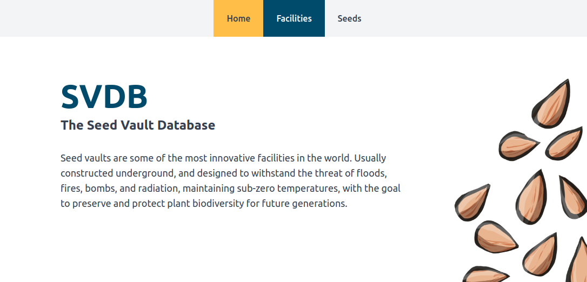

# [SVDB](https://github.com/devmegan/svdb)



Seed vaults exist to preserve plant biodiversity in the event of disaster. The fixture for the SVDB (Seed Vault Database) holds records of 469 seeds, but in reality the world's largest seed vault holds over 2.4 billion seeds.

This project provides a postgres database that includes tables for seeds, facilities, and a join table that connects them. 

A flask app provides the interface to the seed vault database. Users hit routes which trigger functions to query and retrieve data from the database. This is then formatted into JSON data and passed into HTML templates to be rendered for the user.

## Contents

- [Quickstart](#quickstart)
- [Postgres](#postgres)
    - [Schemas](#schemas)
        - [Table: facilities](#table-publicfacilities)
        - [Table: seeds](#table-publicseeds)
        - [Join Table: facilities_seeds](#table-publicfacilities_seeds)

## Quickstart

- `cp .env .env.local`
- Fill out the DB values there. To base it off the defaults in the makefile, use:
```
PGRES_HOST=<vaults-pgres container IP address>
DB_NAME=vaults
DB_USERNAME=postgres
DB_PASSWORD=<DB_PASSWORD>
```

- `$ pip install requirements.txt`
- `$ make build`
- `$ make start pw=<DB_PASSWORD>` where DB_PASSWORD matches with the value in `.env.local`
- Click through to flask app from dev server, or run `$ make postgres-shell` to interact with db directly.

## Postgres

`$ make postgres-shell` will bring up the postgres shell.

To view the tables on the "vaults" database, use `\dt+`.

### Schemas

To generate table schemas from the postgres shell use:

- `# \d <table_name>`

#### Table "public.seeds"

| Column Name | Data Type | Nullable | Constraints |
| --- | --- | --- | --- |
| id | integer | not null | PRIMARY KEY |
| latin_name | character varying(50) | not null | |
| common_name | character varying(50) | not null | |
| type | character varying(50) | not null | |

Indexes:
- "seeds_pkey" PRIMARY KEY, btree (id)

Referenced by:
- TABLE "facilities_seeds" CONSTRAINT "facilities_seeds_seed_id_fkey" FOREIGN KEY (seed_id) REFERENCES seeds(id)

#### Table "public.facilities"

| Column Name | Data Type | Nullable | Constraints |
| --- | --- | --- | --- |
| id | integer | not null | PRIMARY KEY |
| name | character varying(50) | not null | |
| city | character varying(50) | not null | |
| country | character varying(3) | not null | |

Indexes:
- "facilities_pkey" PRIMARY KEY, btree (id)

Referenced by:
- TABLE "facilities_seeds" CONSTRAINT "facilities_seeds_facility_id_fkey" FOREIGN KEY (facility_id) REFERENCES facilities(id)

#### Table "public.facilities_seeds"

| Column Name | Data Type | Nullable | Constraints |
| --- | --- | --- | --- |
| id | integer | not null | PRIMARY KEY |
| facility_id | integer | | FOREIGN KEY REFERENCES facilities(id) |
| seed_id | integer | | FOREIGN KEY REFERENCES seeds(id) |

Indexes:
- "facilities_seeds_pkey" PRIMARY KEY, btree (id)
